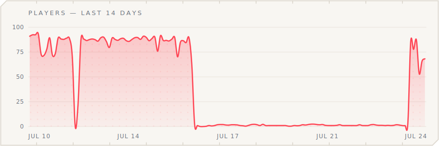

<p align="center">
  <picture>
    <source media="(prefers-color-scheme: dark)" srcset="assets/hero-dark.svg">
    
  </picture>
</p>

<p align="center">
  <a href="../../releases/latest"></a>
  &nbsp;&nbsp;&nbsp;&nbsp;
  <a href="../../releases"></a>
</p>

<p align="center">
  <b>Classic 1.7.10 combat for modern Paper &amp; Folia.</b><br>
  The hits, knockback, and combos of golden-era PvP — latency-compensated, anticheat-friendly,
  and tuned from the era's real game code, not folklore.
</p>

<br>

<p align="center">
  <a href="https://bstats.org/plugin/bukkit/Mental/31788"><picture>
    <source media="(prefers-color-scheme: dark)" srcset="assets/stats/players-dark.svg">
    
  </picture></a>
</p>

<br>

<p align="center">
  
</p>

<table>
<tr>
<td width="50%" valign="top">
<br>
<b>Precision-tuned Knockback</b><br>
Choose the legacy 1.7.10 formula or the modern one, with presets for both.
<code>signature</code>, Mental's own, feels like <code>mmc</code> knockback, perfect for practice
servers.
</td>
<td width="50%" valign="top">
<br>
<b>Async Hit Registration &amp; Knockback</b><br>
Attacks are intercepted on the netty thread and register <b>sub-tick</b>, in packet-arrival
order — combat runs <b>faster than vanilla</b>.
</td>
</tr>
<tr>
<td width="50%" valign="top">
<br>
<b>Fair at any ping</b><br>
Latency compensation keeps knockback and combos identical at 5&nbsp;ms or 150&nbsp;ms — all
server-authoritative, so anticheats verify it cleanly.
</td>
<td width="50%" valign="top">
<br>
<b>One jar, every server</b><br>
One download covers every Paper build from 1.9.4 to 26.x plus Folia, on <b>Java 8+</b> with no
flags. Every release passes a <b>live test matrix across every supported server</b>.
</td>
</tr>
<tr>
<td width="50%" valign="top">
<br>
<b>The full 1.8 ruleset — optional</b><br>
A library of <b>switchable modules</b>: old armour, no attack cooldown, 1.8 crits, golden apples,
sword blocking, and more. <i>All OFF by default.</i>
</td>
<td width="50%" valign="top">
<br>
<b>Run it from in-game</b><br>
<code>/mental</code> opens a full management menu — flip modules and switch presets live, no
restart. Everything is still plain, documented YAML.
</td>
</tr>
</table>

<br>

<p align="center">
  
</p>

1. **Download** `Mental-<version>.jar` from [the latest release](../../releases/latest).
2. **Drop it** into your server's `plugins/` folder.
3. **Restart.** That's it — the defaults are the classic combat, no setup required.

Configuration is generated under `plugins/Mental/` on first boot, and every option is
documented inside its own file. Upgrading from an old single-file config? It migrates
automatically — your tuned values become `profiles/custom.yml` (and stay selected), and the
original is kept as `config-v1-backup.yml`.

> **No dependencies.** Mental needs nothing else installed. (PlaceholderAPI is supported but
> optional.)

<br>

<p align="center">
  
</p>

Mental runs two complete knockback calculations — choose the one your server should feel like:

- **Legacy** — the true 1.7.10 formula: sprint resets, residual stacking, era verticals.
  A full preset library in `profiles/legacy/`, every knob tunable.
- **Modern** — the modern vanilla formula, with the same customization surface. Presets
  in `profiles/modern/`: `modern-vanilla`, `modern-uplift`, `modern-combo`.

Both sides expose the full knob set — pushes, friction, verticals, air multipliers, w-tap
bonuses — so `custom` can start from either world.

<br>

<p align="center">
  
</p>

The knockback profile is one server-wide setting — pick it in-game or in `knockback.yml`.

| Preset | The feel |
|---|---|
| `signature` | Mental's own tuning — the recommended default for competitive 1.8-style PvP. |
| `lunar` | The archived Lunar Network values — a lighter, floatier trade. |
| `badlion` | The classic Badlion feel — firm horizontal, honest verticals. |
| `velt` | A modern practice-server tuning — snappy and consistent. |

More ship alongside: `kohi`, `minehq`, `mmc`, `legacy-1.7`, `legacy-1.8`, `custom`
(yours to edit) in `profiles/legacy/`, and `modern-vanilla`, `modern-uplift`, `modern-combo`
in `profiles/modern/` for servers on the modern knockback formula. The full guide to what
each knob does lives in [docs/knockback-profiles.md](docs/knockback-profiles.md).

<br>

<a id="faster-than-vanilla"></a>
<p align="center">
  
</p>

**Vanilla waits twice.** An attack packet queues for the next tick, then the knockback waits
for the next entity-tracker pulse — 10–50 ms of server-side dead time before the victim
feels anything, on top of ping.

Mental removes both waits:

- **Read on arrival.** Attacks are intercepted on the netty thread and validated against
  per-tick snapshots — no waiting on the main thread.
- **Pre-sent feedback.** The victim's knockback and both players' hurt animation ship
  straight from the netty thread — one round-trip leg earlier than vanilla.
- **One frame, guaranteed.** On 1.19.4+ velocity and hurt animation travel in one packet
  bundle — the knock and the flinch can never split across frames.
- **Immune to lag.** Registration runs async to the server core: if TPS drops, hits still
  register at full speed, exactly as on a server at optimal performance.
- **Still authoritative.** Damage runs on the main thread through the full vanilla event
  chain, and the pre-send uses the same profile math — prediction and truth never disagree.

The full pipeline, edge cases included: [docs/fast-path.md](docs/fast-path.md).

<br>

<p align="center">
  
</p>

`/mental` (or `/mtl`) opens the management menu — operators only, by default:

- **Dashboard** — every feature family at a glance, toggle anything live.
- **Knockback** — switch the server's preset, inspect the active values.
- **Combat Effects** — hit sounds, particles, damage indicators, death effects, with presets.
- **No restarts** — changes apply immediately; `/mental reload` re-reads the files from console.

Your hand-edited YAML is never rewritten: in-game changes are stored as a separate overlay,
so comments and formatting in the files you maintain stay exactly as you left them.

<br>

<p align="center">
  
</p>

Everything lives under `plugins/Mental/`, split by topic — each file documents every key it holds:

| File | What it controls |
|---|---|
| `config.yml` | Module toggles, metrics, debug. |
| `knockback.yml` | The selected knockback profile. |
| `profiles/` | The preset library (`legacy/` and `modern/`) — add your own here. |
| `combat.yml` | Hit registration, reach, latency compensation. |
| `combo.yml` | The combo solver family. |
| `rules.yml` | The optional 1.8 ruleset modules. |
| `effects.yml` + `effects/presets/` | Combat effects and their presets. |
| `pots.yml` | Splash-potion utilities. |
| `loot.yml` | Loot protection. |

<br>

<p align="center">
  
</p>

Mental always owns hit delivery and knockback. Everything below is **opt-in** — all OFF by
default, each a one-line toggle, grouped by family:

| Family | What turning it on does |
|---|---|
| **Damage** | 1.8 armour strength &amp; durability, old critical hits, old tool durability, sword blocking. |
| **Combat Cadence** | Removes the 1.9 attack cooldown, sweep attacks, and swing sounds. |
| **Sustain** | 1.8 golden apples, potion values &amp; durations, old regen, no ender-pearl cooldown. |
| **Loadout** | Off-hand and crafting restrictions, era hitboxes and reach. |
| **Combo Solver** | Holds the sweet-spot combo distance on the fresh knock; optional reach handicap. |
| **Potions** | `/potfill` and steep-throw instant pots. |
| **Combat Effects** | Hit sounds and particles, pop-off damage indicators, death effects. |
| **Loot Protection** | A slain player's drops reserved for their killer, gold-glowing until they expire. |

> **Running another combat-rules plugin?** Enable each rule in exactly one plugin — the same
> rule enabled twice applies twice.

<br>

<p align="center">
  
</p>

**Does it work with anticheats?**
Yes — combat is server-authoritative, so movement-prediction anticheats verify it cleanly.
When one is detected, Mental automatically stands down its packet-level fast path and stays
correct.

**Do my players need a mod or a specific client?**
No. Everything is server-side; vanilla clients, Lunar, Badlion, and 1.7-animation mods all
just work.

**Can I keep modern 1.9+ combat and only fix knockback?**
Yes — that's the default install. The 1.8 ruleset is entirely opt-in; out of the box Mental
changes knockback, hit registration, and latency fairness only.

**Does it replace OldCombatMechanics?**
It can. The optional ruleset covers the OCM rule set — pick one plugin per rule and Mental
handles the rest natively, including the parts OCM can't touch (delivery and knockback).

**Folia?**
Supported — every release is gated on a real Folia server before it ships.

**Something feels off — how do I debug?**
`/mental debug subscribe` streams what Mental sees (hits, knocks, sprint reads) to your chat
in real time.

<br>

<p align="center">
  
</p>

| | |
|---|---|
| **Server** | Paper 1.9.4 → 26.x (every version) · Folia |
| **Java** | 8 or newer — whatever your server already runs, no flags |
| **Dependencies** | None (PlaceholderAPI optional) |
| **Tested** | Every supported Paper version + Folia boots live in the release gate, every release |

One jar covers the whole range: modern JVMs load Mental's Java-17 code, older JVMs load a
byte-equivalent Java-8 build packed in the same file. On 1.9.4–1.10.2 a handful of
trajectory self-tests are skipped (those era servers don't simulate offline players'
motion) — gameplay is unaffected.

<br>

<p align="center">
  
</p>

Modules: `api` (public surface) · `kernel` (pure-JDK combat model) · `platform` (Bukkit seam)
· `core` (the plugin) · `compat-folia` · `tester` (live-server harness).

**Public API** — `me.vexmc:mental-api` (generation 3): combo lifecycle events, an
authoritative combat-state query service, capability discovery, and knockback outcome
control. The jar ships with every release; the contract lives in
[docs/api-gen3-integration-surface.md](docs/api-gen3-integration-surface.md) with rulings in
[docs/api-gen3-rulings.md](docs/api-gen3-rulings.md).

```bash
./gradlew build                  # unit tests + compatibility gates
./gradlew integrationTestMatrix  # every supported server, live
```

Deep dives: [fast path](docs/fast-path.md) · [knockback profiles](docs/knockback-profiles.md)
· [combo hold](docs/combo-hold.md) · [legacy tier](docs/legacy-combat.md) · the combat
research ledger in [docs/research/](docs/research/).

Licensed [MIT](LICENSE) · third-party notices [here](THIRD-PARTY-NOTICES.md) · anonymous
usage metrics via bStats (opt out in `config.yml`).

<br>

<p align="center">
  
</p>

<p align="center"><sub><b>MENTAL</b> by <a href="https://github.com/owengregson">@owengregson</a></sub></p>
